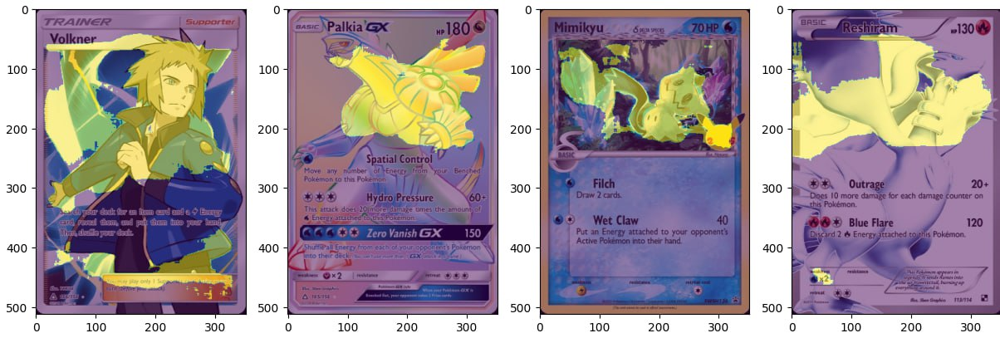

# Pokemon Card Segmentation

Simple segmentation model using [Unet architecture](https://arxiv.org/abs/1505.04597) able to predict binary masks of Pokemons trading cards. Unfortunately, at the moment no pokemon segmentation dataset is available. The model is trained on a custom dataset generated from cards' foil effects.


<p align = "center">
Figure 1. Example prediction of cards that the model never saw during training.
</p>

## Getting started

Clone and install required dependencies. Its recommended to use conda to create a python environment.

```
git clone <>
cd <>

conda create -n pkm python=3.11
conda activate pkm
pip install -r requirements.txt
```

## Making predictions

Download the weights from the releases, update the checkpoint path in `settings.py` then run:

`python predict -file path/to/card.png` 

or 

`python predict -folder path/to/folder/containing/cards`

to generate masks and overlapped images inside `output` folder.

## Dataset

Since no dataset is available and creating a decent amount of labels manually would require a lot of time, I developed a simple script that generates reasonable labels starting from card foils scrapped from the internet. 


<p align = "center">
Figure 2. Types of card foil effects.
</p>

As you can see from the image above, a good amount of foil effects are pretty hard to convert into actual segmentation labels especially on newer cards (see Figure 1) where the Pokemon uses almost all the space available. In some cases, this type of card can generate acceptable labels. 

At the moment, I used only regular cards whereas the Pokemon uses only half of the space to train the model. This means that the predictions generated on cards like Figure only rely on the generalization capabilities of the model. 

Labels generated from newer cards, despite being somewhat acceptable, tend to be really noisy and confuse the model leading to poor generalization on unseen cards.


<p align = "center">
Figure 3. Example of the generated label for a card starting from its foil effect.
</p>

The data pre-processing can be found in `data_preprocess.py`.


